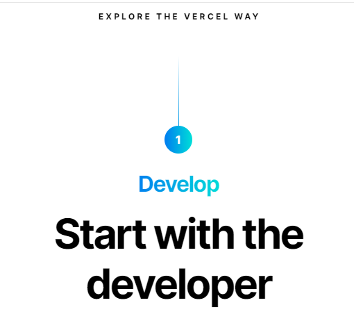

# Dom Manipulation Assignment

### Topics

    - Query Selector, Inner HTML


1. Website Name: [Dev To](https://dev.to/)

### Sample Image


### Tasks

        Target the Top description div and change the DEV Community to <Your_Name> and description to your passion

### Output


### Solution
```javascript
document.querySelector(".sidebar-wrapper .lh-tight").innerHTML = "iNeuron"
document.querySelector(".sidebar-wrapper .crayons-card .color-base-70").innerHTML = "I Write Code"
```

2. Website Name: [Apple](https://support.apple.com/en-in)

### Sample Image


### Task

### Fetch all the product name and store in an array

### Output

['iPhone', 'Mac', 'iPad', 'Watch', 'AirPods', 'Music', 'TV']

### Solution
```javascript
let grabElement = document.querySelectorAll(".as-imagegrid-item-title")
fetchData = [];
for(let i=0; i<=grabElement.length; i++){fetchData.push(grabElement[i].innerHTML.split(" ")[0])}
```

3. Website Name: [Youtube Support](https://support.google.com/youtube/)

### Topics

    - Get Element By Id, Create Element, Create Text Node, Append Child

### Sample Image


### Tasks

     Add another FAQ 'My New FAQ' to the list

### Output


### Solution

```javascript
let grabElement = document.querySelector(".accordion-homepage");
newFaqSection = document.createElement('section');
myNewFaq = document.createElement('h3');
myNewFaq.innerText = "My New FAQ"
newFaqSection.appendChild(myNewFaq);
grabElement.appendChild(newFaqSection);
newFaqSection.className = "parent";
```

4. Webiste Name: [OnePlus](https://www.oneplus.in/support)

### Topics

     Query Selector, InnerText

### Sample Image


### Tasks

      Change the contact number

### Output


### Solution
```javascript
document.querySelector(".item--subtitle").innerHTML = "6366256689"
```
5. Webiste Name: [Samsung](https://www.samsung.com/in/offer/online/samsung-fest/)

### Topics

       getElementById, createElement, InnerText, append, setAttribute

### Sample Image


### Tasks

     Target the main div of card and change the Button text to Check out

### Output


### Solution

```javascript
let samsungBtn = document.querySelectorAll(".diwali-deals-product-sale-btn")[30]
samsungBtn.innerText = "Check Out"
```

6. Webiste Name: [Adidas](https://www.adidas.co.in/)

### Topics

    -   Query Selector, Event listeners, Changing Styles

### Sample Image


### Tasks

     Target the search box and on hover change thebackground color to red.

### Output


### Solution

```javascript
let icon = document.querySelector(".searchinput___19uW0");
icon.addEventListener('mouseenter',()=>{icon2.style.backgroundColor = "red"});
icon.addEventListener('mouseout',()=>{icon2.style.backgroundColor = "none"});
```

7. Webiste Name: [MDN Web Docs](https://developer.mozilla.org/en-US/)

### Topics

       Form, Value, Submit

### Sample Image


### Tasks

     To Search a topic in the MDN Search bar.
     First add a text to search in the search bar and then hit the submit search button to search the docs using DOM

### Output


### Solution
```javascript
document.querySelector(".search-input-field").value = "CSS Selectors"
document.querySelector("#top-nav-search-form").submit();
```

8. Website Name: [Google](https://www.google.com/)

### Topics

       Remove Elements

### Sample Image


### Tasks

     Remove alternate languages from the home page languages listed

### Output


### Solution
```javascript
languageRemover = document.querySelector("#SIvCob").childNodes
for(let i = languageRemover.length-2; i>1; i=i-4){languageRemover[i].remove()}
```

9. Website Name: [Code Wars](https://www.codewars.com/)

### Topics

       Change Font Family, Color of Text.

### Sample Image


### Tasks

    Change the font family of the text to monospace and text color to the logo’s background color.

### Output


### Solution
```javascript
document.querySelector(".text-color-white").style.color = "#b03d3d"
document.querySelector(".text-color-white").style.fontFamily = "Monospace"
```

10. Website Name: [Freecodecamp](https://www.freecodecamp.org/)

### Topics

       querySelector, mouseover, click eventListener,  callback function, style,

### Sample Image


### Tasks

    Target the button and change background colour on mouseover

### Output


### Solution

```javascript
let getStarted = document.querySelectorAll(".login-btn-text")[1];
trial.addEventListener('mouseenter',()=>{trial.style.backgroundColor = "red"});
trial.addEventListener('mouseout',()=>{trial.style.backgroundColor = "transparent"});
```

11. Website Name: [realme](https://www.realme.com/in/)

### Topics

       querySelector,style,background-image

### Sample Image


### Tasks

    change the realme logo to ineuron logo

### Output


### Solution

```javascript
document.querySelector(".icon-logo").style.backgroundImage = "URL('https://learn.ineuron.ai/_next/image?url=%2Fimages%2Fineuron-logo.png&w=1920&q=75')"
```

12. Website Name: [Github](https://github.com/)

### Topics

       querySelector,style,background-Color

### Sample Image


### Tasks

     change the background colour of the button to blue.

### Output


### Solution

```javascript
document.querySelectorAll(".btn-primary")[1].style.backgroundColor = "blue"
```

13. Website Name: [Hackerrank](https://www.hackerrank.com/)

### Topics

       querySelector,innerHtml

### Sample Image


### Tasks

Target the top description and change “Matching developers with great companies” to ‘JSBOOTCAMP“.

### Output


### Solution
```javascript
let hackerRank = document.querySelector(".home22-intro-text").childNodes[0].innerHTML = "JS Bootcamp"
```

14. Website Name: [Asus](https://www.asus.com/in/)

### Topics

      querySelector,style,font-size

### Sample Image


### Tasks

       change the fontsize of “Hot Deals” to 80px

### Output


### Solution

```javascript
document.querySelector(".HotDealsAll__Heading__2fIbe").style.fontSize = "80px"
```
15. Website Name: [Dell](https://www.dell.com/en-in/shop/deals/laptop-deals?gacd=10415953-9016-5761040-285981356-0&dgc=ST&gclid=Cj0KCQjwguGYBhDRARIsAHgRm4-XUDMhhVNyHXb3s1gY4ZBzORr_d9Se-buhJwy7asyUe7YdqEA11eEaAt6UEALw_wcB&gclsrc=aw.ds&nclid=BxjBlpBQsX6pjSHh-L8YYSU77EpfXRkG1AGMB5Wbeu386ykspfrPDnfx_DdFau20)

### Topics

      querySelector,style.textAlign

### Sample Image


### Tasks

       Convert the text “G15 Gaming Laptop” from left to right

### Output


```javascript
let g15 = document.querySelectorAll(".ps-top")[4];
g15.querySelector(".ps-title").style.textAlign = "right"
```

16. Website Name: [Vercel](https://vercel.com/)

### Topics

     querySelector,innerHTMl

### Sample Image



### Tasks

      change the heading “Start with the developer” to “Start with Scratch”

### Output


### Solution

```javascript
document.querySelector(".section-title_title__VEDfK").innerHTML = "Start with scratch"
```
17. Website Name: [Sony](https://www.sony.co.in/)

### Topics

    querySelector,innerHTMl

### Sample Image


### Tasks

     change the button text To current Date.

### Output


### Solution

```javascript
let sonyBtn = document.querySelector(".btn-container");
let now = new Date();
sonyBtn.innerHTML = now.toString();
```

18. Website Name: [Philips](https://www.philips.co.in/)

### Topics

     querySelector,style,backgroundcolor

### Sample Image


### Tasks

    change the background colour blue to orange

### Output


### Solution

```javascript
document.querySelector(".p-footer").style.backgroundColor = "orange"
```

19. Webiste Name: [Canon](https://in.canon/)

### Topics

          querySelector,src

### Sample Image


### Tasks

    extract the canon logo

### Output


### Solution

```javascript
console.log(document.querySelector(".navbar-brand").childNodes[1].currentSrc);
```

20. Website Name: [Oppo](https://www.oppo.com/in/)

### Topics

          querySelector,style,color

### Sample Image


### Tasks

      Change the description colour black to orange

### Output


### Solution

```javascript
document.querySelectorAll(".desc")[3].style.color = "orange"
```